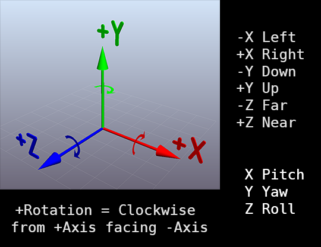

# AppGameKit-Framework-Libraries
A collection of various utility functions.

***This is all very much a work in progress.***

---

## A note about Vectors & Thetas:
Upon dealing with the incoherent mess of 3D vector spaces in ComputerGraphics, Mathematics, Aviation, etc.<br/>
And then learning that "there is no 'correct' vector space", they are arbitrary.<br/>
This is the vector space that I've decided to use:



---

## Variable & Function Naming:
These rules are adhered to, unless I've overlooked something.

* Naming follows hierarchal ordering. That being: ThingAttribute.<br/>
  Example: instead of "NewLength", "LengthNew" is used.<br/>
  *Note: this is the opposite of typical English grammar.*

* Naming uses Capitals for the first letter of every word, lowercase for the rest. This includes acronyms.<br/>
  Exceptions include constants and some other rare occasions.

* Underscores are typically avoided.<br/>
  There are exceptions...

* Single-letter & overly-truncated variable/function names are avoided, unless desired for compact code.<br/>
  Common Abbreviations:
```
Pos = "Position"
Rot = "Rotation"
Siz = "Size"
Scl = "Scale"
Nrm = "Normal"
Rds = "Radius"
Dir = "Direction" or "Directory"
Clr = "Color"

Dlt = "Delta"

Deg = "Degrees"
Rad = "Radian"

Inv = "Inverse"
Cmp = "Complement"
Rcp = "Reciprocal"

Pnt = "Point"
Lin = "Line"

Cir = "Circle"
Tri = "Triangle"
Rct = "Rectangle"

Vrt = "Vertex"
Edg = "Edge"
Ray = "Ray"

Pln = "Plane"
Sph = "Sphere"
Box = "Right-Angled-Quadrilateral-Hexahedron" :P
```

* Descriptive indexes are always used, never i, j, x, y, a, b, etc.<br/>
  Examples:
```
FOR iThg = 0 TO Thing.length
    Print(Thing[iThg])
NEXT iThg

FOR iPlyr = 0 TO Player.length
    Player[iPlyr].Pos.x = 5.0 + iPlyr
NEXT iThg

FOR iY = 0 TO Thing_SizY
    FOR iX = 0 TO Thing_SizX
        Print(Thing[iY,iX])
    NEXT iX
NEXT iY
```

* An attempt is made to make the nameing & usage of variable & function names read like a natural language sentence.
